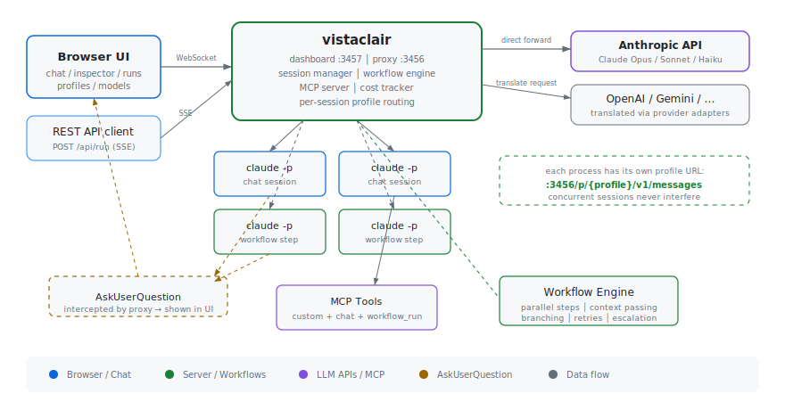
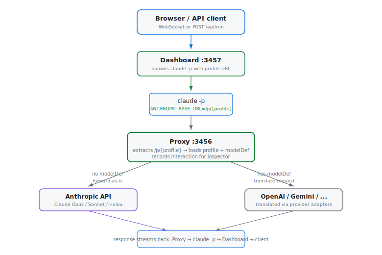

<div align="center">


# $\Huge\textsf{vistaclair}$

$\large\textsf{\color{#58a6ff}inspect\color{#8b949e}{\kern{6mu}·\kern{6mu}}\color{#3fb950}chat\color{#8b949e}{\kern{6mu}·\kern{6mu}}\color{#bc8cff}route}$

[](https://opensource.org/licenses/Apache-2.0)
[](https://nodejs.org)

A development dashboard that wraps [Claude Code](https://docs.anthropic.com/en/docs/claude-code) with real-time API inspection,
multi-session chat, file management, terminal access, and multi-provider model routing.

[Getting started](#getting-started) ·
[Features](#features) ·
[Free vs Pro](#free-vs-pro) ·
[Architecture](#architecture) ·
[Contributing](CONTRIBUTING.md) ·
[Pro](https://hpfreilabs.com)

</div>

---

## Use cases

| | |
|---|---|
| $\color{#58a6ff}{\textsf{Study the wire protocol}}$ | See exactly what Claude Code sends and receives: system prompts, tool schemas, SSE events, token counts, costs |
| $\color{#3fb950}{\textsf{Remote access}}$ | Run Claude Code on a powerful machine and control it from a phone, tablet, or any browser |
| $\color{#bc8cff}{\textsf{Multi-provider routing}}$ | Route Claude Code through OpenAI, Gemini, DeepSeek, Kimi, or local models via provider translation |
| $\color{#79c0ff}{\textsf{Tool development}}$ | Create and test custom MCP tools from a form-driven editor without leaving the browser |
| $\color{#d29922}{\textsf{File management}}$ | Browse, preview, and manage files on the remote machine with a full-featured file manager |

---

## Getting started

### Prerequisites

- **Node.js 18+** and **npm**
- [Claude Code CLI](https://docs.anthropic.com/en/docs/claude-code) installed and authenticated

<details>
<summary><b>Installing Node.js and npm</b></summary>

**macOS** (via Homebrew):
```bash
brew install node
```

**Ubuntu / Debian**:
```bash
curl -fsSL https://deb.nodesource.com/setup_22.x | sudo -E bash -
sudo apt-get install -y nodejs
```

**Windows**: download the installer from [nodejs.org](https://nodejs.org/)

Verify the installation:
```bash
node --version   # v18+ required
npm --version
```

</details>

### Install

```bash
git clone https://github.com/hpfrei/vistaclair.git
cd vistaclair
npm install
```

> [!IMPORTANT]
> Always run `npm install` after cloning or pulling new changes to install dependencies.

Run `claude` once manually to authenticate if you haven't already. With a Max subscription, just run `claude login` -- no API key needed.

### Run

```bash
npm start
```

On startup, an auth token is printed to the console:

```
Auth token (auto-generated):
c0b253eb-c650-4def-ba2c-4b2b1b545d85
```

Open **http://localhost:3457** and log in with the token.

> [!TIP]
> Custom port: `npm start -- 8080` or `DASHBOARD_PORT=8080 npm start`

> [!TIP]
> Inspect an external Claude Code session by pointing it at the proxy:
> ```bash
> ANTHROPIC_BASE_URL=http://localhost:3456 claude -p "your prompt"
> ```

### Environment variables

| Variable | Default | Description |
|---|---|---|
| `AUTH_TOKEN` | auto-generated | Dashboard auth token |
| `PROXY_PORT` | `3456` | API proxy port (localhost only) |
| `DASHBOARD_PORT` | `3457` | Web dashboard port (all interfaces) |
| `ANTHROPIC_TARGET_URL` | `https://api.anthropic.com` | Upstream API URL |
| `MAX_HISTORY` | `200` | Max interactions kept in memory |

> [!WARNING]
> The dashboard binds to `0.0.0.0` for remote access. It is protected by the auth token, but do not expose it to untrusted networks without TLS/VPN.

### Running with full system access

By default, Claude Code sessions spawned from vistaclair run under your user account. To unlock its full potential -- letting Claude install packages, configure services, modify system files, and set up entire environments from scratch -- run vistaclair as root:

```bash
sudo npm start
```

This gives every Claude Code session spawned from the dashboard full root access. Combined with the **full** profile (`bypassPermissions`), Claude can:

- Install system packages (`apt install`, `brew install`, `snap install`)
- Configure and start services (nginx, PostgreSQL, Docker, systemd units)
- Manage users, permissions, and SSH keys
- Set up development toolchains and language runtimes
- Modify system configuration files (`/etc/`, crontabs, environment)
- Build and deploy applications end-to-end
- Mount filesystems, manage disks and network interfaces

#### Recommended: use a VM

Running an AI agent as root is powerful but carries risk on your primary machine. A virtual machine gives you the best of both worlds -- full system access in an isolated sandbox where nothing can escape:

```bash
# On a fresh Ubuntu VM:
curl -fsSL https://deb.nodesource.com/setup_22.x | sudo -E bash -
sudo apt-get install -y nodejs git

# Install Claude Code CLI
npm install -g @anthropic-ai/claude-code
claude login   # authenticate once

# Clone and run vistaclair as root
git clone https://github.com/hpfrei/vistaclair.git
cd vistaclair && npm install
sudo npm start
```

Then open `http://<vm-ip>:3457` from your host browser. You now have a remote, browser-controlled Claude with root access in a disposable environment.

> [!TIP]
> **Snapshot before, experiment freely.** Take a VM snapshot before starting. If Claude misconfigures something, roll back in seconds. This is the fastest way to iterate on complex system setups.

> [!TIP]
> **Headless servers and cloud VMs work great.** vistaclair's dashboard is fully browser-based -- no desktop environment needed. A $5/month VPS or a local QEMU/VirtualBox VM is all it takes.

#### What you can ask Claude to do with root

Once running with `sudo`, spawn a **full** profile session and try things like:

- *"Set up a complete LAMP stack with PHP 8.3, MariaDB, and a sample WordPress site"*
- *"Install Docker, pull the postgres:16 image, create a database, and set up pgAdmin"*
- *"Configure nginx as a reverse proxy for three Node.js apps with SSL via Let's Encrypt"*
- *"Install and configure Tailscale so I can access this VM from anywhere"*
- *"Set up a Python 3.12 virtualenv, install PyTorch with CUDA support, and verify GPU access"*
- *"Create a systemd service that runs this Node.js app on boot with automatic restart"*

Claude handles the full loop -- installing dependencies, writing configs, starting services, verifying everything works, and fixing issues along the way.

---

## Features

### $\color{#58a6ff}{\textsf{Inspector}}$

A transparent proxy that captures every API call between Claude Code and the upstream LLM -- across all sessions, all providers, in real time.

- Full request/response capture with headers, payloads, and timing
- Live SSE event stream -- watch `message_start`, `content_block_delta`, tool calls as they arrive
- Hierarchical timeline: turns > tool calls, with search and filtering
- Token usage breakdown: input, output, cache read, cache creation
- **Cost tracking** per interaction, per model, per provider
- Live **markdown rendering** of assistant responses in the detail panel
- Profile flags (bare mode, auto-memory) shown per request
- All interactions saved to disk as structured JSON for offline analysis

### $\color{#3fb950}{\textsf{CLI (Multi-tab Terminal)}}$

Multi-tab Claude Code terminal sessions managed from the browser.

- **Multiple independent tabs**, each running a separate `claude` process
- Spawn sessions in any directory with the filesystem picker
- Per-session settings: model routing, profiles, working directory
- **Session save and resume** -- close a session and pick it up later with full context
- **AskUserQuestion** interception -- Claude's questions appear inline, answers are injected back transparently
- Live **task panel** -- `TaskCreate`/`TaskUpdate` tool calls rendered as a draggable status board
- Directory-spawned tabs shown with distinct `>dirname` label and green accent
- Stop running sessions at any time
- Inline tab rename via double-click

### $\color{#d29922}{\textsf{Profiles}}$

Named capability bundles that control how `claude` is spawned.

| Setting | CLI flag | Description |
|---|---|---|
| Model | `--model` | sonnet, opus, haiku, or custom model ID |
| Effort | `--effort` | low, medium, high, max |
| Permission mode | `--permission-mode` | default, acceptEdits, plan, bypassPermissions, dontAsk, auto |
| Allowed/disabled tools | `--allowedTools` / `--disallowedTools` | Per-tool enable/disable via checkboxes |
| Model definition | profile `modelDef` field | Route through a third-party model |
| Bare mode | `--bare` | Strip skills and MCP servers |
| Disable auto-memory | `CLAUDE_CODE_DISABLE_AUTO_MEMORY=1` | Prevent auto-memory writes |
| Slash commands | `--disable-slash-commands` | Enable/disable built-in skills |
| Max turns | `--max-turns` | Cap agentic loop iterations |
| Budget | `--max-budget-usd` | Dollar spend limit per run |
| System prompt | `--append-system-prompt` / `--system-prompt` | Append to or replace the default system prompt |
| MCP servers | `--mcp-config` | Integrated server with custom tools |

**Built-in profiles:**

| Profile | Permission mode | Description |
|---|---|---|
| $\color{#3fb950}{\texttt{full}}$ | `bypassPermissions` | All tools, no prompts |
| $\color{#d29922}{\texttt{safe}}$ | `acceptEdits` | No bash, write, edit, or destructive tools |
| $\color{#58a6ff}{\texttt{readonly}}$ | `plan` | Only Read, Glob, Grep, AskUserQuestion |
| $\color{#8b949e}{\texttt{minimal}}$ | `plan` | Only Read, Glob, Grep; slash commands disabled |

Duplicate any built-in profile to create an editable custom profile with full control over all settings.

### $\color{#bc8cff}{\textsf{LLM Provider Adapters}}$

Route Claude Code through non-Anthropic models. The proxy translates Anthropic Messages API requests into the target provider's format and translates responses back -- Claude Code sees a normal Anthropic API.

| Provider | Models | Notes |
|---|---|---|
| **Anthropic** | Claude Opus 4.6, Sonnet 4.6, Haiku 4.5 | Direct passthrough (no translation) |
| **OpenAI** | GPT-5.4, GPT-5.4 Pro / Mini / Nano | via `api.openai.com` |
| **Google Gemini** | Gemini 3.1 Pro, 3 Flash, 2.5 Flash | 1M context, reasoning support |
| **DeepSeek** | V3.2, R1 Thinking | 128K context |
| **Moonshot (Kimi)** | K2.5, K2 Thinking | 256K context |
| **Ollama** | Any local model | localhost base URL |

Model definitions are configured in `capabilities/models.json`. API keys stored separately in `capabilities/secrets.json` (gitignored). Each model can specify system prompt handling (`replace` / `prepend` / `append` / `passthrough`), reasoning mode, context window, max output tokens, and cost per million tokens.

### $\color{#f778ba}{\textsf{Proxy Rules}}$

Programmable request/response manipulation at the proxy layer.

- Match requests by path, headers, or body patterns
- Transform, block, or redirect matched requests
- Configured via `capabilities/proxy-rules.json`

### $\color{#79c0ff}{\textsf{MCP Tool Manager}}$

Extend Claude Code with custom tools through one integrated MCP server.

- Form-driven tool editor with typed parameters (string, number, boolean, object, array)
- Auto-generated `server.js` and per-tool handler files -- you only write the handler body
- Enable/disable tools with checkboxes, restart indicator when changes need applying
- Inline testing with parameter inputs and result display
- All MCP tool calls logged in the Inspector

**Built-in MCP tools** (always available):

| Tool | Description |
|---|---|
| `chat` | Run a prompt through Claude Code, supports multi-turn via `session_id`, profile and cwd selection |

The `chat` tool enables **delegation** -- a Claude session can spawn sub-conversations with different profiles (e.g. an orchestrator using `chat` to delegate research to a `readonly` session).

### $\color{#8bb97a}{\textsf{Directories (File Manager)}}$

Full-featured file browser with multi-tab support.

- Browse the remote filesystem with breadcrumb navigation and sort controls
- **Preview grid** -- toggle thumbnail previews for all files in a directory (images, text snippets, binary icons)
- **File overlay** -- click any file to open a full preview overlay with Monaco editor for code, native rendering for images/audio/video/PDF
- **Keyboard navigation** -- arrow keys to browse, left/right to navigate between files in the overlay, Escape to close
- **Multi-select and bulk delete** -- checkboxes fade in on hover, click to select, delete bar appears in the toolbar
- **Integrated shell** -- spawn a terminal in any directory's context
- File search with filename/content regex and date filters
- Download any file directly from the browser

### $\color{#f0883e}{\textsf{Skills, Agents, and Hooks}}$

- **Skills** -- create and edit skills (`.claude/skills/<name>/SKILL.md`) with supporting template files
- **Agents** -- custom sub-agents with their own system prompts, models, and tool restrictions
- **Hooks** -- lifecycle hooks (`PreToolUse`, `PostToolUse`, `Stop`, etc.) with command, prompt, or agent handlers

### $\textsf{Themes}$

Two built-in themes toggled from the header: **Bright** (checker-paper grid, default) and **Dark** (Tokyo Night palette).

---

## Free vs Pro

| Feature | Free | Pro |
|---------|:----:|:---:|
| API Inspector & cost tracking | ✓ | ✓ |
| Multi-session CLI terminal | ✓ | ✓ |
| LLM provider routing | ✓ | ✓ |
| MCP tool manager | ✓ | ✓ |
| File manager | ✓ | ✓ |
| Proxy rules engine | ✓ | ✓ |
| Profiles & model config | ✓ | ✓ |
| Skills, agents, hooks | ✓ | ✓ |
| **Apps Platform** | — | ✓ |

[Get vistaclair Pro →](https://hpfreilabs.com)

---

## Architecture

<picture>
  <source media="(prefers-color-scheme: dark)" srcset="docs/architecture-dark.svg">
  <source media="(prefers-color-scheme: light)" srcset="docs/architecture-light.svg">
  
</picture>

vistaclair runs two servers from a single Node.js process:

| Server | Port | Binding | Purpose |
|---|---|---|---|
| **Proxy** | `:3456` | `127.0.0.1` | Intercepts all Claude API calls for inspection and model routing |
| **Dashboard** | `:3457` | `0.0.0.0` | WebSocket + web UI (auth-protected) |

### Per-session isolation

Every `claude` process gets its profile baked into its base URL at spawn time:

```
ANTHROPIC_BASE_URL = http://localhost:3456/p/{profileName}
```

This means the profile is **immutable for the process lifetime**. Switching profiles in the browser never affects a running session. Concurrent chats and API calls are fully isolated.

### Request flow

<picture>
  <source media="(prefers-color-scheme: dark)" srcset="docs/request-flow-dark.svg">
  <source media="(prefers-color-scheme: light)" srcset="docs/request-flow-light.svg">
  
</picture>

### AskUserQuestion interception

When `claude` calls the `AskUserQuestion` tool during a session:

1. The proxy intercepts the tool call in the API response stream
2. When `claude` sends back the error `tool_result`, the proxy pauses the request
3. The proxy broadcasts `ask:question` to the dashboard UI
4. The UI renders the question with options and free text input
5. User answers, UI sends `ask:answer` back via WebSocket
6. Proxy rewrites the `tool_result` with the real answer and continues the API call
7. Claude resumes as if the tool succeeded normally

---

## Project structure

```
server.js                  Entry point -- proxy + dashboard servers, auth
src/
  proxy.js                 API forwarding, SSE passthrough, provider routing, per-session profiles
  proxy-rule-handler.js    Programmable proxy request/response rules
  sse-passthrough.js       Zero-copy SSE transform stream
  api.js                   REST API endpoints (filesystem browsing, file serving, search, delete)
  ask-schema.js            AskUserQuestion schema definitions
  cli-session.js           Spawns claude with profile flags and session resume
  cli-sessions.js          Multi-tab session manager
  dashboard-ws.js          WebSocket server and broadcast hub
  capabilities.js          Profiles, models, providers, hooks, skills, agents CRUD
  store.js                 In-memory interaction store with disk persistence
  utils.js                 Central spawn function, process tracking, stream parsing
  providers/
    base.js                Provider adapter interface
    openai.js              OpenAI-compatible adapter (OpenAI, DeepSeek, Moonshot, Ollama)
    gemini.js              Google Gemini adapter (native REST API)
    registry.js            Provider registry
  mcp/
    index.js               MCP init, auto-start, tool probing, inspector logging
    servers.js             Tool CRUD, server.js/tool file generation
    templates.js           MCP server file templates
    logs.js                MCP call logging
    registrar.js           Reads/writes .mcp.json and ~/.claude.json
lib/
  mcp-bridge.js            Stdio bridge Claude Code spawns via --mcp-config
  hook-reporter.js         Hook event reporting bridge
public/
  index.html               Dashboard SPA
  login.html               Auth token login page
  home.js                  Home view documentation (overview, architecture, tools)
  core.js                  WebSocket, view switching, markdown rendering, process counter
  capabilities.js          Profile/model/tool/skill/agent/hook management UI
  inspector.js             Inspector timeline and detail panel
  cli.js                   Multi-tab CLI session UI and settings
  directories.js           File manager -- browsing, previews, overlay, selection, shell
  rules.js                 Proxy rules editor UI
  mcp.js                   MCP tool manager UI
  mcp.css                  MCP-specific styles
  style.css                Layout and structural styles
  theme-bright.css         Bright theme (default)
  theme-dark.css           Dark theme (Tokyo Night)
  tools.html               Standalone MCP tool testing page
capabilities/
  models.json              Pre-configured LLM provider models
  anthropic-pricing.json   Anthropic model pricing (auto-refreshable)
  proxy-rules.json         Proxy rule definitions
  secrets.json             API keys (gitignored)
  profiles/                Custom profile JSON files
mcp-servers/integrated/    Auto-generated MCP tool server + built-in tools
interactions/              Saved API call history (per-session directories)
docs/
  architecture-*.svg       Architecture diagrams (light + dark theme)
  request-flow-*.svg       Request flow diagrams (light + dark theme)
```

---

## License

**Apache 2.0** — see [LICENSE](LICENSE). Copyright 2026 [hpfreilabs.com](https://hpfreilabs.com)

Free to use, modify, and redistribute. Attribution required — derivative works must preserve the [NOTICE](NOTICE) file and copyright notices.

> **vistaclair Pro** — the Apps Platform and additional features — is a separately licensed commercial add-on. [Learn more →](https://hpfreilabs.com)
